Problem Statement = done
Features = done
Tech Stack = done
Architecture = done
Screenshots = done
Live Demo = done
Installation = done
Performance = done
Scalability = done
Security = done
Future Improvements = done

## Problem Statement
The construction sector faces major challenges due to the lack of a unified digital platform connecting workers, contractors, suppliers, and customers. Communication gaps, unverified labor availability, inefficient material procurement, delayed project coordination, and limited transparency create difficulties for all stakeholders involved in construction projects.

Skilled workers such as masons, carpenters, plumbers, electricians, and helpers often struggle to find consistent employment opportunities, while builders, contractors, and homeowners face challenges in finding reliable and skilled labor on time. Similarly, suppliers and shopkeepers dealing with construction materials like cement, bricks, sand, steel, paint, and hardware have limited digital reach and inefficient methods for managing customer connections and deliveries.

Existing solutions are fragmented and do not provide an integrated ecosystem that combines workforce hiring, supplier management, service discovery, communication, and project coordination in one place. This results in increased project delays, higher operational costs, reduced productivity, and lack of trust among stakeholders.

To address these issues, **NirmaanSetu** aims to develop a centralized digital platform that connects all aspects of the construction sector by enabling seamless interaction between employees, employers, suppliers, and customers. The platform will simplify hiring, improve accessibility to construction materials and services, enhance transparency, and create a more efficient and organized construction ecosystem.


## inspiration
1. Upwork
2. Fiverr

## Users 
## for phase 1 
   Employees = Mistry, Helper, Engineers, Carpenter and many more), 
   Employers(Any Common man, Contractors, Builders), 
   Shopkeepers/Suppliers(cement, gitti, balu, chhar, paint, water-related, pipe-related and many more)


# NirmaanSetu - Backend

**NirmaanSetu** is a comprehensive platform designed to bridge the gap between various stakeholders in the construction sector. It connects employees (skilled labor like engineers, masons, and carpenters), employers (builders, contractors, and individual homeowners), and suppliers (shopkeepers providing construction materials).

## 🚀 Key Features
- **Multi-Stakeholder Ecosystem**: Integrated platform for Employees, Employers, and Suppliers.
- **AI-Powered Search**: Advanced vector search capabilities using Spring AI and Elasticsearch for matching skills with requirements.
- **Secure Authentication**: Robust security implementation using JWT (JSON Web Tokens) and Twilio for OTP-based verification.
- **ELK Stack Integration**: Centralized logging and monitoring using Elasticsearch, Logstash, and Kibana.
- **Real-time Data Management**: Optimized performance with Redis caching.
- **Automated Cleanup**: Scheduled tasks for managing soft-deleted records and data retention.

## 🛠 Tech Stack
- **Framework**: Spring Boot 3.x
- **Language**: Java 17
- **AI/ML**: Spring AI (OpenAI Embeddings)
- **Database**: MySQL (Persistence), Redis (Caching)
- **Search Engine**: Elasticsearch (Vector Store)
- **Monitoring**: ELK Stack (Elasticsearch, Logstash, Kibana), Prometheus, Actuator
- **Communication**: Twilio SMS API
- **Documentation**: Swagger/OpenAPI 3.0
- **Containerization**: Docker & Docker Compose

## 📋 Prerequisites
- JDK 17 or higher
- Maven 3.6+
- Docker & Docker Compose
- OpenAI API Key (for AI features)
- Twilio Account (for SMS features)

## Architecture
For the **Architecture** section in your README, you should explain how the system is structured, what technologies are used, and how different parts of the platform interact with each other.

Since your project is a large-scale construction ecosystem platform, your architecture section can include:

* Frontend
* Backend
* Database
* Authentication
* APIs
* User Roles
* Deployment/Scalability
* Future AI integrations (optional)

You can write something like this:

---

# Architecture
NirmaanSetu follows a modern full-stack web architecture designed to support scalability, modularity, and real-time interaction between stakeholders in the construction sector.

### Frontend
The frontend is built using:
* Next.js
* React.js
* TypeScript
* Tailwind CSS
* Material UI (MUI)

The frontend provides responsive and user-friendly interfaces for:
* Employees
* Employers
* Suppliers
* Admins

### Backend
The backend is responsible for:
* Authentication & Authorization
* Job Management
* Supplier Listings
* User Management
* Notifications
* API Handling

Technologies used:
* Node.js
* Express.js / Next.js API Routes
* REST APIs

### Database
The platform uses a relational database for storing:
* User Information
* Job Listings
* Material Listings
* Orders
* Reviews & Ratings
* Project Data

Database & ORM:
* MySQL / PostgreSQL
* Prisma ORM

### Authentication
Authentication system includes:
* Secure Login & Registration
* Role-Based Access Control (RBAC)
* JWT / Session-based Authentication

### User Roles
The platform supports multiple user roles:
1. Employee
2. Employer
3. Supplier
4. Admin
Each role has separate dashboards and permissions.

### Platform Workflow
1. Employers post construction-related work.
2. Employees apply for available jobs.
3. Suppliers list construction materials and services.
4. Customers can search and connect with workers or suppliers.
5. Admin manages platform activities and verification.

### Scalability & Future Scope
The architecture is designed to support:
* AI-based recommendations
* Real-time communication
* Geo-location services
* Multi-language support
* Cloud deployment
* Large-scale concurrent users
---
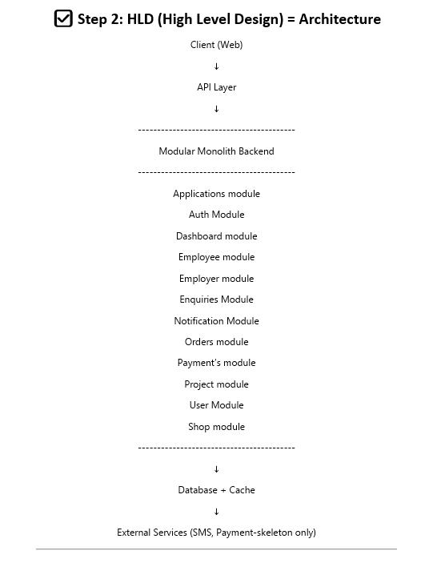

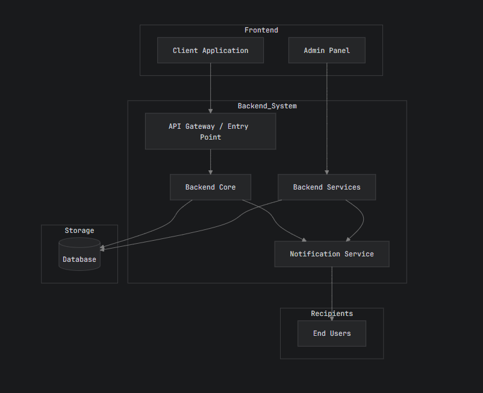

## Screenshots
1. Landing/Home Page
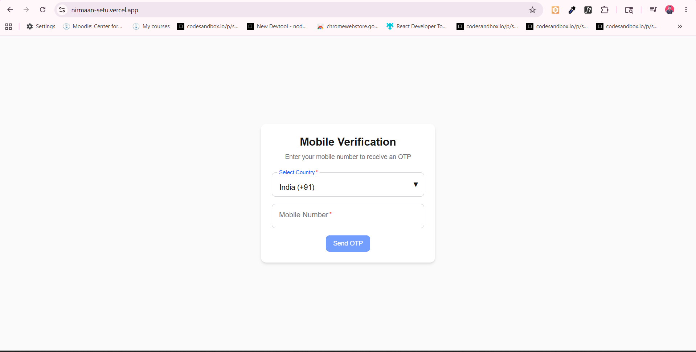
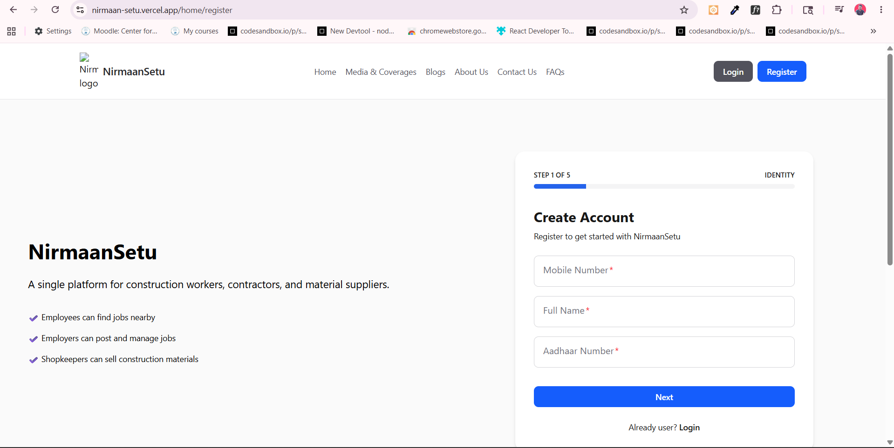
2. Login Page
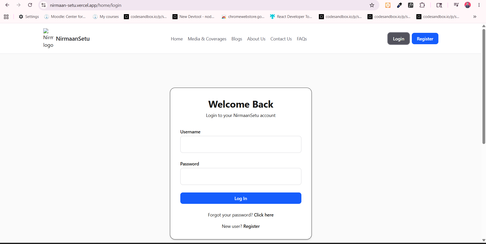
3. Dashboard Screens
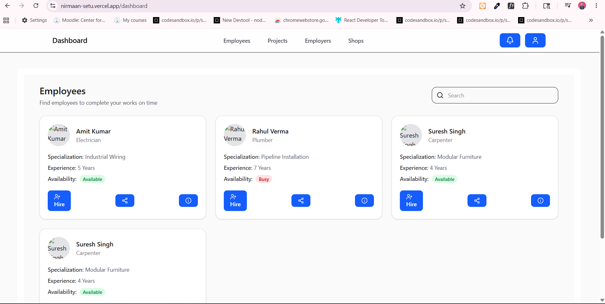
4. Employer Dashboard
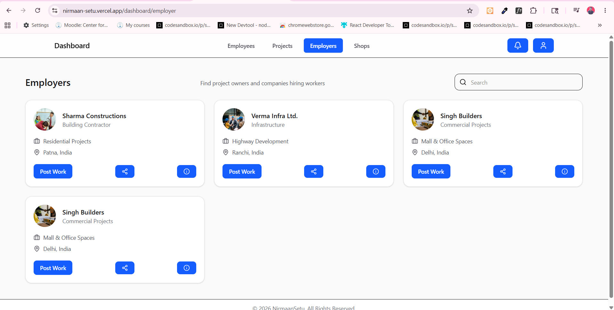
5. Supplier Dashboard
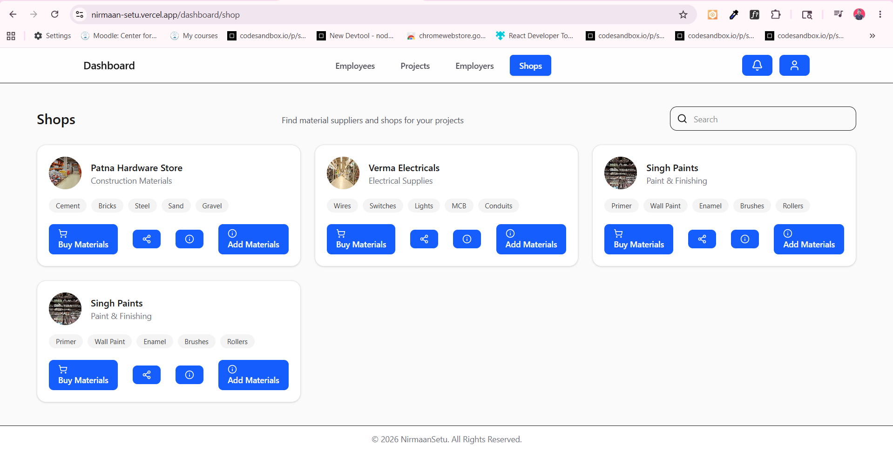
6. Job Listing Page
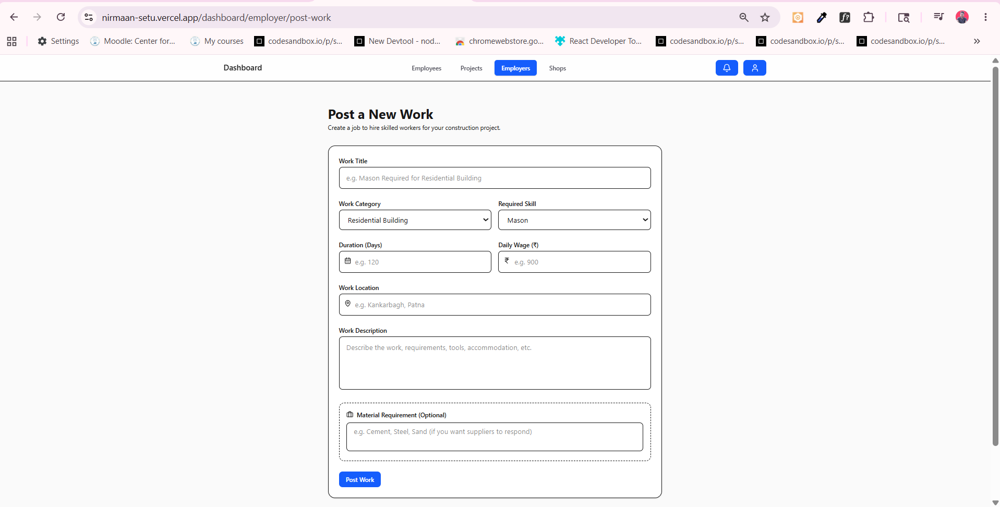
7. Material Marketplace
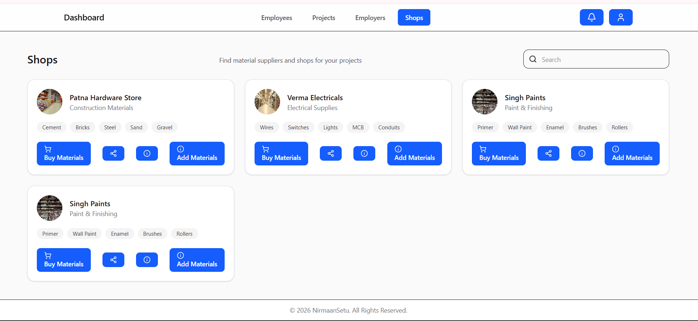
8. Worker Profile Page
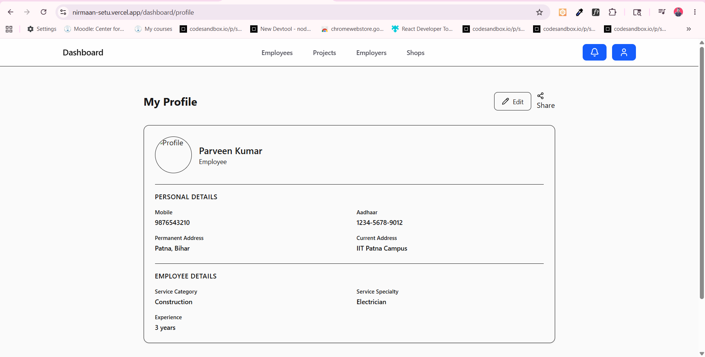
9. Notification system 
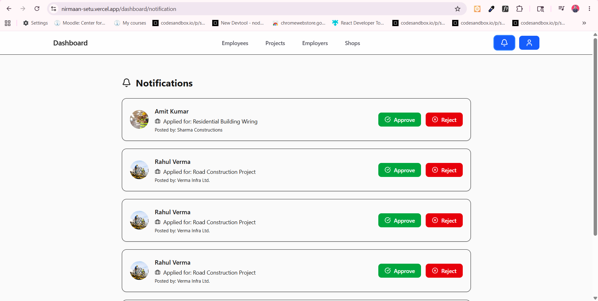

## Live Demo

🚀 Main Application:  
https://nirmaan-setu.vercel.app/

🛠️ Admin Panel:  
The Admin project deployment is in progress.
Live demo link will be added soon.

📱 Responsive Design Supported for:
- Mobile
- Tablet
- Desktop

## ⚙️ Installation & Setup
1. **Clone the repository**:
   ```bash
   git clone <repository-url>
   cd backend
   ```

2. **Environment Variables**:
   Create a `.env` file or set the following environment variables:
   ```env
   TWILIO_ACCOUNT_SID=your_sid
   TWILIO_AUTH_TOKEN=your_token
   TWILIO_PHONE_NUMBER=your_number
   OPENAI_API_KEY=your_openai_key
   ENCRYPTION_SECRET=your_encryption_secret
   JWT_SECRET=your_jwt_secret
   ```

3. **Spin up Infrastructure**:
   Use Docker Compose to start the ELK stack and other services:
   ```bash
   docker-compose up -d
   ```

4. **Build and Run**:
   ```bash
   ./mvnw clean install
   ./mvnw spring-boot:run
   ```

## 🧪 Testing & Verification
Run the following commands to ensure code quality:
- **Build without tests**: `.\mvnw clean install -DskipTests`
- **Run Unit Tests**: `.\mvnw test`
- **Full Verification**: `mvn verify` (This also updates `swagger-docs.json`)

## 📖 API Documentation
Once the application is running, you can access the Swagger UI at:
`http://localhost:8080/swagger-ui.html` (or the configured port)

## 🏗 Project Structure
- `src/main/java`: Backend source code.
- `src/main/resources`: Configuration files (`application.properties`, logback config).
- `logstash/`: Logstash pipeline configurations.
- `.zencoder/`: Project-specific AI rules and documentation.
- `docker-compose.yml`: Infrastructure orchestration.
---

## Performance
### Frontend Optimization
* Server-side rendering (SSR) and static rendering using Next.js
* Optimized component rendering
* Lazy loading and code splitting
* Image optimization using Next.js Image component
* Responsive UI for mobile, tablet, and desktop devices

### Backend Performance
* Efficient REST API handling
* Optimized database queries
* Scalable backend architecture
* API response optimization

### Database Optimization
* Indexed database queries
* Relational schema optimization
* Efficient data fetching using Prisma ORM

### Scalability
* Modular architecture for easy scaling
* Supports large numbers of users and listings
* Cloud deployment ready

### User Experience
* Fast page navigation
* Smooth dashboard interactions
* Optimized loading states and error handling

### Security & Reliability
* Authentication and authorization handling
* Protected API routes
* Input validation and error management
---

### Performance Techniques Used
- Caching strategies
- Optimized API calls

  
## Scalability
NirmaanSetu is designed with a scalable and modular architecture to support a growing number of users, services, suppliers, and construction projects across different regions.

### Modular System Design
The platform follows a modular architecture where frontend, backend, database, and services are separated for easier maintenance and future expansion.

### Multi-User Support
The system is built to handle multiple types of users simultaneously, including:
* Employees
* Employers
* Suppliers
* Admins

### Database Scalability
* Optimized relational database structure
* Efficient query handling using Prisma ORM
* Indexed data for faster search and retrieval
* Supports large volumes of users, jobs, and material listings

### Cloud Deployment Ready
The platform is designed for deployment on scalable cloud infrastructure such as:
* AWS
* Vercel
* Render

### Performance Optimization
* Lazy loading
* Code splitting
* Optimized API calls
* Server-side rendering with Next.js
* Efficient state management

### Future Scalability Goals
The architecture supports future integrations such as:
* AI-powered worker and supplier recommendations
* Real-time communication and notifications
* Geo-location and map services
* Multi-language support
* Mobile application integration
* Analytics and reporting systems

### Global Expansion Ready
NirmaanSetu is being designed to support large-scale adoption in the construction industry with the capability to expand across cities, states, and international markets.


## Security
NirmaanSetu follows modern web security practices to ensure secure access, protected user data, and reliable platform operations.

### Authentication & Authorization
* Secure user authentication system
* Role-Based Access Control (RBAC)
* Protected routes and APIs
* Session/JWT-based authentication

### Data Protection
* Secure handling of user information
* Input validation and sanitization
* Prevention of unauthorized data access
* Environment variable protection for sensitive credentials

### API Security
* Secure REST API communication
* Request validation and error handling
* Restricted access to protected endpoints
* Prevention of invalid or malicious requests

### Frontend Security
* Form validation
* Secure authentication flow
* Safe state and session management
* Protection against common frontend vulnerabilities

### Database Security
* ORM-based secure database queries using Prisma
* Reduced risk of SQL injection attacks
* Controlled database access permissions

### Infrastructure Security
* HTTPS-ready deployment
* Secure cloud deployment practices
* Scalable and maintainable backend architecture

### Future Security Enhancements
Planned security improvements include:
* Two-Factor Authentication (2FA)
* Rate limiting
* Activity logging and monitoring
* Email and phone verification
* Advanced admin moderation tools
---

# Optional Technical Additions
If implemented, you can also mention:
* CSRF protection
* XSS prevention
* Password hashing using bcrypt
* Secure cookies
* Content Security Policy (CSP)
* API throttling

Example:
```md id="h1t9p4"
### Additional Security Measures
- Password hashing using bcrypt
- Protection against XSS and CSRF attacks
- Secure API middleware
- Authentication token expiration handling
```
---
Since your project targets global-scale users, adding a strong Security section makes the README look much more professional and production-oriented.


## Future Improvements
NirmaanSetu is designed as a scalable construction ecosystem platform, and several advanced features are planned for future development.

### Planned Features
* Real-time chat between workers, employers, and suppliers
* AI-based worker and supplier recommendation system
* Geo-location and nearby service discovery
* Multi-language support for regional and international users
* Mobile application for Android and iOS
* Push notifications and email alerts
* Digital payment integration
* Project tracking and progress monitoring
* Advanced analytics and reporting dashboard
* Worker verification and certification system
* Supplier inventory and stock management
* Review and rating system for trust building

### Technical Enhancements
* Microservices-based backend architecture
* Real-time updates using WebSockets
* Caching and CDN optimization
* Improved search and filtering system
* Advanced role-based access control
* Offline support and PWA features

### AI & Smart Features
* AI-powered hiring suggestions
* Smart material cost estimation
* Predictive demand analysis
* Construction project recommendation engine
* AI chatbot support system

### Scalability Goals
* Expansion to multiple cities and countries
* Support for large-scale concurrent users
* Cloud-native infrastructure deployment
* Enterprise-level construction management solutions

### Security Enhancements
* Two-Factor Authentication (2FA)
* Activity monitoring and audit logs
* Fraud detection mechanisms
* Advanced admin moderation system
---

# Optional Professional Ending
You can end the section with:
```md id="rzk8yu"
NirmaanSetu aims to become a complete digital ecosystem for the construction industry by continuously improving scalability, accessibility, security, and user experience.
```

     ## NirmaanSetu - Building Bridges in Construction.